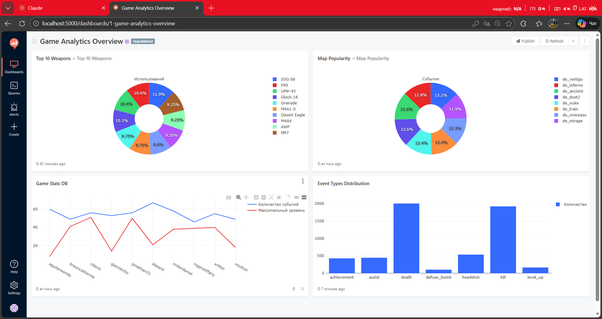

# 🎮 Game Statistics E2E System

Система автоматизированного сбора, хранения и визуализации игровой статистики в реальном времени.

## 📋 Описание проекта
Этот проект реализует полный цикл обработки данных (End-to-End):
1. **Генерация данных**: Python-скрипт имитирует действия игроков (убийства, смерти, достижения) и отправляет их в базу данных каждую секунду.
2. **Хранение**: PostgreSQL в Docker-контейнере хранит все события в таблице `game_events`.
3. **Визуализация**: Redash подключается к базе и отображает аналитику на интерактивном дашборде.

## 📊 Дашборд аналитики


*На дашборде представлены:*
* **Top 10 Weapons** — самое популярное оружие среди игроков.
* **Hourly Activity** — график интенсивности событий по времени.
* **Event Types Distribution** — соотношение убийств, смертей и достижений.
* **Leaderboard** — топ игроков по набранным очкам.

## 🛠 Технологический стек
* **Python 3.11** (библиотеки `psycopg2`, `faker`)
* **PostgreSQL 15** (основное хранилище)
* **Docker & Docker Compose** (контейнеризация всех сервисов)
* **Redash** (BI-инструмент для визуализации)

## 🚀 Как запустить проект

1. **Клонируйте репозиторий:**
   ```bash
   git clone [https://github.com/Zucchiny/Game.git](https://github.com/Zucchiny/Game.git)
   cd Game